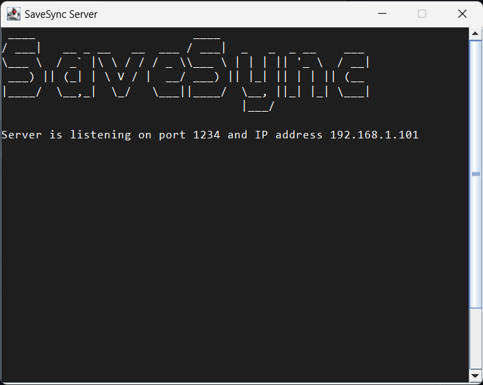

# Server

Cette branche contient le serveur avec des sauvegardes ZIP

## Informations générales du projet

- Application Java avec le JDK OpenJDK 21.0.1
- Projet Maven
- Utilisation de socket SSL
- Utilisation d'un annuaire LDAP pour l'authentification des utilisateurs

## Docker

- Docker dans ce projet sera utilisé pour virtualiser le serveur et contient
également un serveur LDAP pour l'authentification des utilisateurs.

### Lancement de du docker 

- Pour lancer le docker, il faut se placer dans le dossier "Server" et lancer la commande suivante :

```bash
docker-compose up -d
```


Un fichier de configuration est déja présent dans le LDAP pour l'authentification des utilisateurs.

- admin / admin

## Lancement du serveur

Le serveur dispose d'une interface graphique recensant les informations le concernant.
Pour lancer le serveur, il suffit d'exécuter le fichier "Server.jar".



## Étapes suivies pour la sécurisation SSL (Côté serveur)

### Étape n°1 : Création d'un Keystore

- Générer un certificat auto-signé avec la commande suivante :

```bash
keytool -genkey -alias myServerKey -keyalg RSA -keystore mySrvKeystore.jks -keysize 2048
```

Résultat de la commande

```bash
gonfiantinig@DESKTOP-PGLUUA7:/mnt/c/Users/Gaetan/OneDrive - umontpellier.fr/Cours IUT 3ème année/Semestre 5/Contuinité d
e service/TD/TD3 - PRA/Application_Sauvegarde/Server/Server_app/resources/SSL/Serveur$ keytool -genkey -alias myServerKey -keyalg RSA -keystore mySrvKeystore.jks -keysize 2048
Enter keystore password:
Re-enter new password:
They don't match. Try again
Enter keystore password:
Re-enter new password:
Enter the distinguished name. Provide a single dot (.) to leave a sub-component empty or press ENTER to use the default value in braces.
What is your first and last name?
  [Unknown]:  Gaëtan Gonfiantini
What is the name of your organizational unit?
  [Unknown]:  IUT
What is the name of your organization?
  [Unknown]:  SaveUnit
What is the name of your City or Locality?
  [Unknown]:  Montpellier
What is the name of your State or Province?
  [Unknown]:  France
What is the two-letter country code for this unit?
  [Unknown]:  FR
Is CN=Gaëtan Gonfiantini, OU=IUT, O=SaveUnit, L=Montpellier, ST=France, C=FR correct?
  [no]:  YES

Generating 2,048 bit RSA key pair and self-signed certificate (SHA384withRSA) with a validity of 90 days
        for: CN=Gaëtan Gonfiantini, OU=IUT, O=SaveUnit, L=Montpellier, ST=France, C=FR
gonfiantinig@DESKTOP-PGLUUA7:/mnt/c/Users/Gaetan/OneDrive - umontpellier.fr/Cours IUT 3ème année/Semestre 5/Contuinité d
e service/TD/TD3 - PRA/Application_Sauvegarde/Server/Server_app/resources/SSL/Serveur$
```

### Étape n°2 : Exporter le certificat public du serveur

Cette commande génère un certificat

```bash
keytool -export -alias myServerKey -file server.cer -keystore mySrvKeystore.jks
```

```bash
gonfiantinig@DESKTOP-PGLUUA7:/mnt/c/Users/Gaetan/OneDrive - umontpellier.fr/Cours IUT 3ème année/Semestre 5/Contuinité de service/TD/TD3 - PRA/Application_Sauvegarde/Server/Server_app/resources/SSL/Serveur$ keytool -export -alias myServerKey -file server.cer -keystore mySrvKeystore.jks
Enter keystore password:
Certificate stored in file <server.cer>
```

## Étapes suivies pour la sécurisation SSL (Côté Client)


### Étape n°1 : Création d'un Keystore pour le client 

```bash
gonfiantinig@DESKTOP-PGLUUA7:/mnt/c/Users/Gaetan/OneDrive - umontpellier.fr/Cours IUT 3ème année/Semestre 5/Contuinité d
e service/TD/TD3 - PRA/Application_Sauvegarde/Server/Server_app/resources/SSL/Client$ keytool -genkey -alias clientKey -keyalg RSA -keystore myClientKeystore.jks -keysize 2048
Enter keystore password:
Re-enter new password:
Enter the distinguished name. Provide a single dot (.) to leave a sub-component empty or press ENTER to use the default value in braces.
What is your first and last name?
  [Unknown]:  Gaëtan Gonfiantini
What is the name of your organizational unit?
  [Unknown]:  IUT
What is the name of your organization?
  [Unknown]:  SaveUnit
What is the name of your City or Locality?
  [Unknown]:  Montpellier
What is the name of your State or Province?
  [Unknown]:  France
What is the two-letter country code for this unit?
  [Unknown]:  FR
Is CN=Gaëtan Gonfiantini, OU=IUT, O=SaveUnit, L=Montpellier, ST=France, C=FR correct?
  [no]:  YES

Generating 2,048 bit RSA key pair and self-signed certificate (SHA384withRSA) with a validity of 90 days
        for: CN=Gaëtan Gonfiantini, OU=IUT, O=SaveUnit, L=Montpellier, ST=France, C=FR
gonfiantinig@DESKTOP-PGLUUA7:/mnt/c/Users/Gaetan/OneDrive - umontpellier.fr/Cours IUT 3ème année/Semestre 5/Contuinité d
e service/TD/TD3 - PRA/Application_Sauvegarde/Server/Server_app/resources/SSL/Client$
```


### Étape n°2 : Importation du certificat dans le keystore du client

Il est important que le keystore du client fasse confiance au certificat généré par le serveur

Commande pour que le keystore du client fasse confiance au certificat du serveur
```bash
keytool -import -alias serverCert -file path/to/server.cer -keystore path/to/clientKeystore.jks
```
Résultat :

```bash
gonfiantinig@DESKTOP-PGLUUA7:/mnt/c/Users/Gaetan/OneDrive - umontpellier.fr/Cours IUT 3ème année/Semestre 5/Contuinité de service/TD/TD3 - PRA/Application_Sauvegarde/Server/Server_app/resources/SSL/Client$ keytool -import -alias serverCert -file server.cer -keystore myClientKeystore.jks
Enter keystore password:
Owner: CN=Gaëtan Gonfiantini, OU=IUT, O=SaveUnit, L=Montpellier, ST=France, C=FR
Issuer: CN=Gaëtan Gonfiantini, OU=IUT, O=SaveUnit, L=Montpellier, ST=France, C=FR
Serial number: 1694f4a077a64948
Valid from: Thu Dec 14 11:56:30 CET 2023 until: Wed Mar 13 11:56:30 CET 2024
Certificate fingerprints:
         SHA1: A9:F4:7A:32:90:A1:29:3E:8A:C3:5D:45:28:78:3C:D7:83:C7:6F:BE
         SHA256: 30:D1:E7:FD:B3:2C:F4:5C:3D:22:C3:A1:4A:1A:35:35:3B:F2:2C:53:00:18:D4:7A:04:B7:8B:F7:41:23:3E:4E
Signature algorithm name: SHA384withRSA
Subject Public Key Algorithm: 2048-bit RSA key
Version: 3

Extensions:

#1: ObjectId: 2.5.29.14 Criticality=false
SubjectKeyIdentifier [
KeyIdentifier [
0000: 4D D8 FC 81 32 44 F0 CC   A1 57 2C F5 D2 F5 4B EC  M...2D...W,...K.
0010: 22 4A 82 20                                        "J.
]
]

Trust this certificate? [no]:  YES
Certificate was added to keystore
gonfiantinig@DESKTOP-PGLUUA7:/mnt/c/Users/Gaetan/OneDrive - umontpellier.fr/Cours IUT 3ème année/Semestre 5/Contuinité de service/TD/TD3 - PRA/Application_Sauvegarde/Server/Server_app/resources/SSL/Client$
```

## Intégration du SSL dans le code

Une fois ces étapes effectuées, les keystores sont prêts à être utilisés dans le code.


